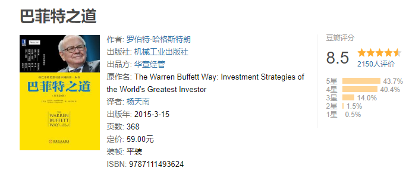
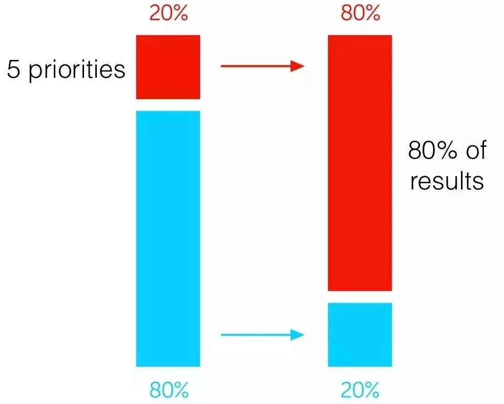
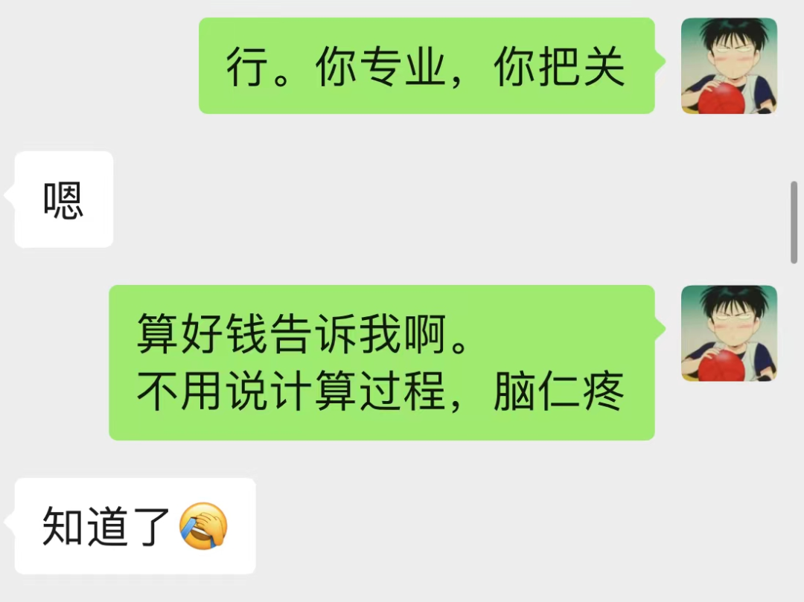

之前看过一本书，叫《巴菲特之道》。

某瓣评分有 8.5，挺不错的。

其中有提到巴菲特的选股之道，和思想理念。

而为啥要聊这本书呢？

因为巴菲特（包括芒格）已经身体力行地证明了，用他们的理念和思想，日子可以过得很好：

1、有钱、富足。

这点不用多说。

2、长寿。

芒格已经 98 岁多，而巴菲特也已经 92 岁了。身体都还挺硬朗。

3、内心富足，家庭美满。

相比许多富豪昙花一现，或不得善终，或身后名极差的情况来看。

这俩确实很优秀。

虽说人生“成功”的定义没有标准，

但他们的这三个“优点”，应该还是值得大部分人关注的。

我也是根据书上，和我看巴菲特的传记等资料，来进行分享的。

把它们称为“巴菲特的五大策略”。

## 巴菲特策略 1：杀死忙碌的时间。

作为世界上最有钱的人之一，旗下管理的资产组合里，员工人数超过 40 万人。

我们想象中，巴菲特应该是非常忙碌的。

不是在开会，就是在视察访问、交流、谈判……

但巴菲特其实非常“悠闲”。

你看，他和芒格每天有大量的时间阅读，自己静静思考。

原因就在于：他们不瞎忙。

比如：

他从不和华尔街的分析师交谈（而大部分 CEO 会花至少 20% 时间在这上面）；

很少接受媒体采访；

不参加行业活动；

明明是金融大鳄，却一直住在清静的乡下小镇，而不是繁华喧闹的纽约……

巴菲特遵循着“二八原则”。

即 80% 的结果和效益，是由 20% 的时间里完成的。

我们也可以观察下自己。

每天睡前回想一天的经过，会发现：

虽然整个白天十几个小时，但拿得出手的“成果”、“效益”可能就那么几件。

（有个两三件，可能就会觉得今天效率不错）

而这三两个“成果”/“进展”，

仔细想想，可能是在两三个甚至一小时半小时内完成的！

也就是，用 20% 的时间，产生了 80% 的效益。

另外 80% 的时间，看起来很多，到处忙活，其实效益很差。

都不知道在干啥！

同事大白最近也有类似的情况。

每天好像都很忙，但工作产出不高，然后又整的很焦虑的样子。

我说，你停一停。

你把工作强度先放下来，思考和梳理清楚再动手。

你甚至可以放放假。

别瞎忙活，整的自己累，然后自己还没啥成长。

“慢慢来，比较快”。

所以，这个策略，其实关键在于：

一定要知道，你最关键的任务或者事情是什么，专注于它。

就跟打仗似的，哪里是关键点，就集中兵力去打。

兵力分散，到处乱跑，兵家大忌啊。

那有人说，哎，虽然参加某个会议，不是我的“核心”。

但是，去参加了也还是有好处，不去的话，有啥损失……

问题就在于，开会花去 1 小时，你或许会得到 1 个单位的收益。

（就像那 80% 的时间，也不是完全没效益，也能产生 20% 的效益嘛）

但如果拿去做核心事情，同样 1 小时，或许有 5 个单位的收益呢？

（这是经济学里“机会成本”的概念。

比如，拿 1 小时去打游戏，不仅仅是浪费了 1 小时，还损失了本来可以看 1 小时书的机会。）

无论是工作，还是个人生活、成长，家庭等等，都适用。

## 巴菲特策略 2：只和那些你认为可以永远共事的人一起工作。

这点我也深以为然。

我翻译过来是：和你觉得舒服、开心的人一起共事。

不只是“工作”，包括“生活”等等，都是如此。

大学时，实践课组队，老师会故意随机组。

而不是大家主动找自己喜欢的伙伴组。

当时老师的解释是：

以后到了社会，有很多无奈，并不是只能和自己喜欢的人合作。

你也得学会和不喜欢的人合作。

那时候觉得挺有道理的。

虽然现在我也觉得有一定的道理。

但是，在我们内心足够强大之前，

我仍然认为和自己志同道合的人待在一起，是非常重要。

心情好、效率高，生活幸福。

我们其实有能力、条件去选择自己喜欢的朋友、工作环境，以及伴侣的。

为什么非要委屈自己呢？

当然，我也承认，在实际操作中，

有时候做这样的选择，有一些困难、成本。

但追求哪样事物没代价呢。

有舍有得啊。

而让自己活得舒适、不拧巴，我觉得是最值“得”的。

在巴菲特身上，他会事先对合作对象进行严格的审查。

他只和他信任的高管们合作，这些执行官们能取得成果，他就会和他们一起工作几十年。

所谓疑人不用，用人不疑，正是如此。

忘了在哪本书上看过。

数十年前，巴菲特投资沃尔玛。

当时上十亿美金的资产交易，巴菲特只是和沃尔玛的掌门人通了个电话，就决定了。

根本没用什么复杂的谈判、合同、法律文书、公证仪式……等等。

就是因为双方知根知底，很清楚对方的为人，都不担心对方坑了自己。

事后也证明，确实如此。

这种，不仅效率高，而且真的心情舒畅，不糟心。

以我自己来说，交朋友非常看重的是坦率、诚实善良。

其他的都不重要（比如学历、能力、长相、性格等）。

现在的朋友圈子，大部分人也都是如此。

比如，我有位朋友，他自己卖茶叶。

我买茶叶从来在他那里买。

我只说，我想要什么茶叶，大概要多少，给谁喝的。

然后，他就会大致给我个建议。

我定了，就问他多少钱，直接转账。

整个过程不超过 5 分钟。

大家知道，茶叶这种东西有时候水挺深的。

可能不小心就用黄金的价格，买了颗白菜。

但和他的交易，我绝不多问，绝无担忧。

不怕他缺斤短两，不怕他虚假销售。

因为他是个实诚人。

有时候实诚到明明是很好的茶叶（或其他物件），

但自己完全不赚钱（或利润极其微薄），搞得朋友们都担心他吃不上饭，经常多给他打点。

不只是这位朋友，生活中这样朋友和例子很多。

你和他在一起没有勾心斗角，没有算计、没有阴谋，非常坦诚而舒服。

别人买个茶，得挑、算、讨价还价……没几个小时下不来。

自己累、浪费时间，还不一定是最优解。

而我 5 分钟搞定，简单舒适。

剩下的大量时间，就可以去做自己喜欢的事情。

当无数个这样的事情，这里几小时，那里几十分钟，那边几天……

累计下来，你就会发现自己的生活非常简单，非常舒适、高效。

不知不觉聊了挺多，

篇幅原因，另外 3 个策略咱们下次再聊。

感兴趣的小伙伴，可以先去翻翻书。

人生处处皆修行。

投资当然也是了。

巴菲特的这几点策略，是比较契合所谓的“修行”的。

它需要我们自己去领悟和尝试。

以上，仅仅是为大家提供一个思考的角度。

如果大家能有一些些启发，那就不枉写了这么长了。

愿大家都能多一些思考，都能活得自在快乐，不拧巴。

## 巴菲特策略 3：让事情保持在超级简单的状态。

巴菲特消除了他公司几乎所有的官僚作风。

伯克希尔的投资组合公司有近 40 万名员工，但伯克希尔总部实际员工只有 20 多名员工。

这还是世界上最大的公司之一。

20 多个人，管理难度就小多了。

巴菲特的个人生活也很简单。

他住在一个不起眼的房子里 (60 年来他一直住在那里) ，每年个人开销只有 10 万美元。

这个开销，说实话，也就跟一个普通美国中产差不多。

在我们的生活中，让事情变得复杂是非常容易的，而且是常态。

比如，很多人别说像巴菲特那么富豪，

即便只是稍微发点小财，生活可能就复杂起来了。

买车、买房，到处显摆，到处找所谓的机会发更多财，

一会儿搞餐饮、旅游、医美，一会儿又是房地产，没准又和合伙人撕逼啥的……

甚至可能私生活还要乱一下……

最后把生活整成一锅粥，乱糟糟。

（我见过不少现实中这样的）

我有一位朋友，生活简单得“令人发指”。

他自己是位手工艺人，做银器的。

在县郊村子里有个院子，每天主要就两件事情：

1、做手工银器；

2、修身养性。

他每天工作十二三个小时，但一点不觉得累；

每天只睡四五个小时，晚上 11 点睡，凌晨 4 点起来做早课；

每天吃 2 顿饭，还都是最简单的素食……

但他出去，村子里的人都认识他，热情友好地打招呼。

他带我们一起去吃饭，

吃完遇到隔壁桌他的一位朋友，顺手默默地帮人把单买了……

这样一位热心肠的人，少有的社交活动，

可能就是志同道合的几位朋友去院里拜访他。

大家一起喝喝茶、聊聊天，打打坐。

他自己活得非常快乐，非常清静。

真可谓是：

结庐在人境，而无车马喧。

问君何能尔？心远地自偏。

和他这种“神人”比，我就“俗”得多了。

但可能和许多都市年轻人比，还算简单点。

每天的事情无非以下几件：

1、写写文章；

2、读书、阅藏、学习；

3、陪伴或联系家人；

4、冥想静坐；

5、遛遛狗，散散步，或者和朋友去山中/海边小聚；

6、偶尔自驾外出溜达穷游。

差不多了，以上活动基本涵盖了日常。

你可能会说，无论是我还是我的朋友，都是很有钱才这样。

其实都还好。

而且我们开支比较小的。

不需要很多钱，也能过成这样。

卖茶叶那位朋友，自己开摩托去几百公里外的泸沽湖游玩。

玩了三天，前后你猜一共花了多少钱？

答案是……

300 块。

路上买点水，吃碗素面，到了就找个空旷地，搭上帐篷。

以天为被，以地为席；

白天看碧湖，清风拂面；

夜晚看银河，流光皎洁。

读读书，泡泡自己带来的茶，打打坐……

哪一样不是享受，哪一样需要花很多钱呢？

那 300 里，其中大头是“加油费”。

要不是现在油价贵，还得更便宜。

再比如，看我喜欢旅游，朋友一直建议我买部车。

我一直没下决心买。

其中一个原因，就是买车会增加我生活的复杂度。

买，花时间；

养护，买保险啥的，花时间；

停车，费劲……

算了吧。

我是个懒人。

我能照顾好自己就不错，还照顾个车。

所以一直没买。

出行咋办？

短途，用电动车；

中途，打滴滴；

长途，租个车。

用完拍拍屁股就走了。

（偶尔，蹭个朋友的车啥的。）

几年下来，我算过的，我用车并不算很多。

打滴滴啥的固然也花钱，但并没有比买辆车的折旧 + 养护来的贵。

我哥十年前买了辆车 10 万块钱。

现在可能净值也就值个小 2 万。

等于花了 8 万。

如果算上油费、保养、停车费等情况，肯定是上 10 万的。

我算了下，这 10 年来，

我花在打滴滴和租车上的钱，应该还不到 10 万……

当然，这是其次。

也只是我个人的情况。

（并不是反对大家买车哈，每个人情况不一样）

我只是以此举例。

保持生活“简单”有代价，但对我来说，真的很爽……

篇幅原因，

剩下的 2 个策略，下次再分享吧。

今天没有聊所谓的投资的太多“术”。

但所谓“道、法、术、器”。

道是真理；

法是规律；

术是技巧知识；

器是工具。

大部分人沉迷在术和器里面。

对“法”没兴趣，还揶揄其是鸡汤，“水货文”。

（对“道”就更别说了，想都没想过）

但老子说：

有道无术，术尚可求也。有术无道，止于术。

他的后代弟子庄子则说：

以道驭术，术必成。离道之术，术必衰。

从这角度来说，

心性指导生活态度，生活态度指导投资。

投资理念指导技巧。

只求技巧，求个估值方法、指标，而忽视了理念，忽视了人生态度，忽视了心性。

都是会酿成“苦酒”的。

这几年我的观察，已经深深验证了这一点。

最后提醒一下，

我当然不是在告诉大家，要没有任何外部社交，不要买车才是所谓的“正确答案”。

每个人缘分和情况都不一样。

人生处处是修行。

愿大家活得简单、快乐自在。

## 巴菲特策略 4：专注于少数高质量的赌注

很多人认为，投资大神，就应该是灵活多变、机密精巧、长袖善舞……

作为一个管理着几万亿资产的超级 CEO 来说，他有许多的决策需要做。

但其实，巴菲特做的投资决策很少。

“决策少”的另一面，就是每一个的质量“高”。

我记得看过一篇他的分享，是给学生们做的。

他说，如果你一辈子只能买一辆车/房，买了就不能换了。

你会怎么做？

是随便买一个，然后稀里糊涂地放着。

还是精挑细选，平时好好保养。

毕竟要用一辈子呢？

头脑清醒的人，都知道是后者。

他常说：

许多人做投资的结果都很糟糕。

但，如果他们在生涯开始时，拿到一张只能打 20 孔的卡片，出手一次就打一个孔。

打完 20 次，就不能再决策出手了。

若是如此，他们的投资结果会有所改善。

“投资的诀窍就是在那里，看着球一个接一个抛过来，等待球到你最拿手、最舒服的高度。

如果此时旁边的人大喊：

“挥棒啊，你这个笨蛋！”

怎么办？

忽略它们。

这当然只是个理念，实际生活中总有许多情况。

但理念是对的。

而且我们大部分人离这个理念太远了。

无论是投资——每天想着搞点骚东西，不动不舒服斯基。

还是婚恋——草草的开始一段感情，又以悲剧结束。

或是职业——人云亦云地选择职业，跳入其中后，又得陇望蜀，见异思迁……

甚至整个人生皆是如此。

有智者说过类似的话：

人类的奇怪之处，就在于他们急于成长，然后又哀叹失去的童年；

他们以健康换取金钱，不久后又想用金钱恢复健康；

他们对未来焦虑不已，却又无视现在的幸福。

因此，他们既不活在当下，也不活在未来。

他们活着，仿佛从来不会死亡；

临死前，又仿佛从未活过。

所以，选择、决策，是多么重要。

专注于少量的赌注——也即“决策”/“选择”，其实是非常科学的。

一个人拥有的精力、可调配的资源一定是有限的。

如果一个人的精力资源是 100，假设，A 一年做 100 个决策，而 B 只做 2 个决策。

则 A 每个平均决策得到的“精力资源”，只有 1。

B 则平均有 50。

质量孰高孰低，非常明显。

从我自己的经历来讲，我其实是一个非常懒的人。

而且我几乎从不参加赌博娱乐。

我一直以为是我不爱冒险，不爱赌。

但回首往事，我发现并不是我不“赌”，我挺爱“赌”的。

只是不喜欢在“小赌博”上花时间精力。

过去十年，其实有几次大的“赌博”：

第一次，辞去国企大公司的工作，背井离乡，抛弃之前的所有，去上海一家初创小公司搏。

第二次，当初的初创小公司做大了不少，前景一片大好，但我决定辞职离开做自由职业。

第三次，关闭星球，寻求新的产品与生活……

这些“赌博”，当时都有许多人不理解、不同意。

但我想，我并不认为自己是“瞎搞”。

是深思熟虑之后，跟着“心”走的决定。

一直到今天，我还是个懒人。

仍然不喜欢在买什么衣服、买什么车子、找什么工作……上面做太多“决策”。

不懂不做，少做决策。

尽量做了，就是大的、高质量的决策。

## 巴菲特策略 5：长期主义

巴菲特会长期持有他的股票。

这个大家都知道。

《商界局外人》中称，他目前持有的前五大股票期权，持有时间平均超过 20 年。

相反的，许多基金平均持有期不到 1 年，巴菲特称之为“吃饱了没事干”、“努力瞎跑，以显得自己在干活”。

其实不仅是投资，生活中更是如此。

巴菲特唯一授权的传记作者，她与巴菲特接触了很多，也了解他很多。

她分享了她从巴菲特身上学到的最重要的东西：

你所学习和投资的东西，应该是能够积累的知识，这样知识就可以建立在知识的基础上。

因此，与其学习一些明天就可能过时的东西，比如某种特定类型的软件 (两年后甚至没有人使用) ，不如选择那些能让你在 10 年或 20 年后变得更聪明的东西。

我现在一直在受益于这个教训。

其实知识，和职业、投资一样，也要讲究复利。

比如，农民工兄弟搬砖就难有“复利”，每多搬 1 万砖，并不会说搬砖变得越来越快，或者工资越来越高。

甚至年龄上去，体力下降，反而收入越来越低。

反之，典型地，像律师，每多做一个案子，就会多积累经验、客户源。

但是，复利的前提就是要“长期”。

因为有时候，刚毕业的大学生，可能收入还不如农民工高。

但是，随着时间的推移，个人的成长，三五年后，就很容易超越了。

长期主义的反义词是“短期主义”。

我们生活中的“短期主义”可太多了：

股票/基金，半年 1 年没赚钱，就受不了；

工作半年一年没啥进展、没升职加薪，就气馁；

不想学习，不想动手练习、计算、实践——虽然我知道这样学到了是自己的，但太累了，无聊。

相反的，抄个代码、跟个实盘，最来劲——而不愿意去思考这些东西都是无常的。

不想学知识、学技能，只想刷抖音、刷剧。

因为尽管我也知道知识技能对我好，但那是以后才可能要用的。

而刷剧，我现在就可以获得快乐！

每天沉迷在资讯、娱乐八卦、浅显的技能上——这些东西的有效性转瞬即逝，毫无“复利”可言。

知道垃圾食品、熬夜对身体不好，还是要吃、做；

知道锻炼、养生对身体好，但没劲，不做……

类似的例子，不胜枚举。

好吧。

这个小系列，大概就到这里了。

## 整理一下巴菲特五策略：

1、杀死繁忙的工作，记得让自己偶尔闲下来。

（别用行动上的勤奋，去弥补思想上的懒惰）

2、只和自己喜欢、信任的人共事。

和谁一起旅行，很大程度决定了旅程的美好程度。

3、让事情始终处在简单的状态。

志闲而少欲，心安而不惧。

4、专注去做高质量的决策（数量得少）。

要学会专注手上的事情，别总是见异思迁，得陇望蜀，心不安定。

5、专注长期主义。

如果想要 3 年后吃上桃子。

你得现在就种树了。

我们把智者的话翻译过来，我希望人们都是：

若我还未成长（打算躺平），就安住于单纯岁月的美好；

若我要去追求身外物，则在健康与金钱之间寻找到平衡；

珍视现在的幸福，活在当下，不过度焦虑虚妄的未来；

尽管岁月大好，人生还很长，仍然珍惜时光，提醒自己生命有终点；

暮年时，回首往事：多么精彩，不枉人间走一遭！

好了，巴菲特的人生策略说完了。

我们都无法做到像巴菲特和芒格那么有钱。

但这并不影响我们的生活可以和他们的一样精彩，不留遗憾，不枉人间走一遭。

周末愉快。

愿认真生活的你，被世界温柔以待~

五个策略，五条理念，

你觉得哪一条是自己以前尚且不足的呢？

## 原文

- [买茶叶，心甘情愿多给了钱。](https://mp.weixin.qq.com/s/N9KcBgyjPtEaJm7tMwWEfA)
- [瞒不住啦，巴菲特的秘密曝光了。](https://mp.weixin.qq.com/s/XDeeMbyk2FxPGMnlcWnS5g)
- [其实，我挺爱“赌”的。](https://mp.weixin.qq.com/s/FY1T69oVK7SOQNOmAhdygw)
