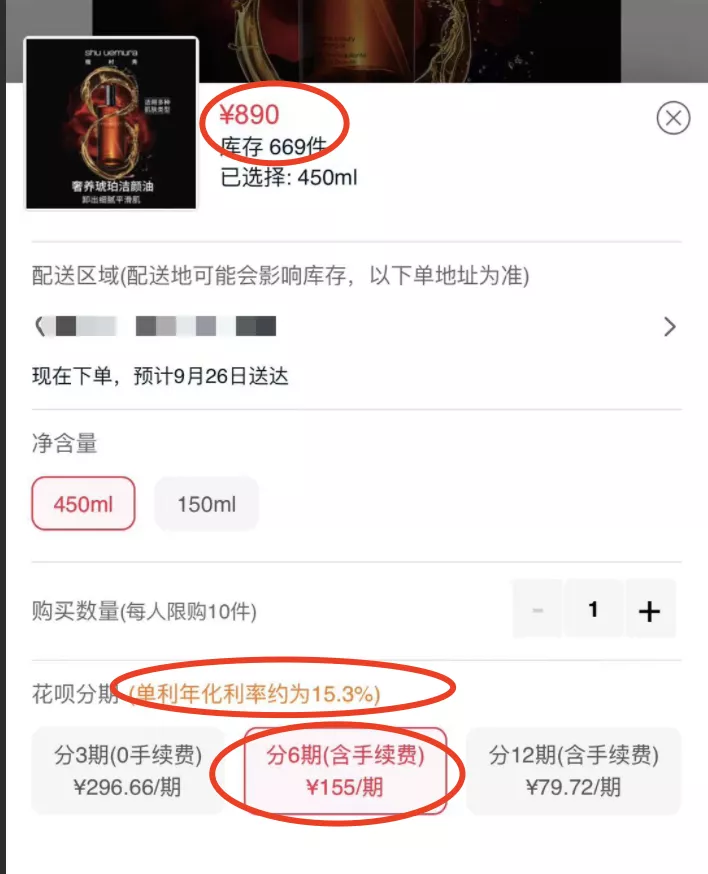
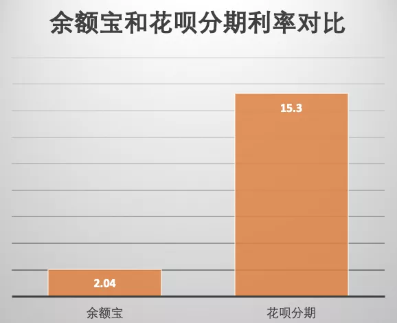
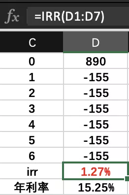
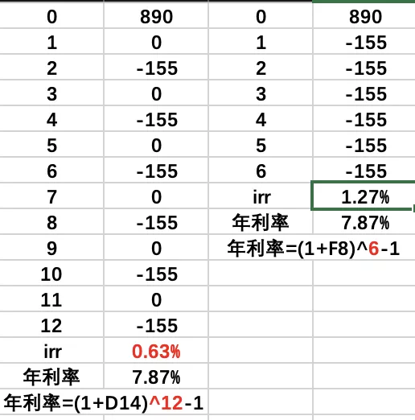
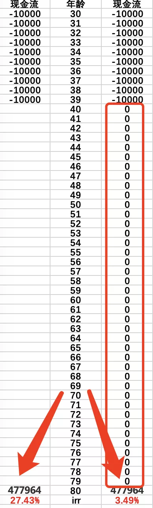

花呗要接入央行征信系统了, 我看有人说再也不敢不还钱了.

emmm~说的好像之前就可以不还钱似的.

一些人不太关心自己的征信, 这样不好.

征信的影响挺大的, 尤其是对于未来有可能买房的人(≈ 每一个人).

接入征信后的花呗其实就等同于一张"信用卡", 不会因为你有花呗, 就不给你贷款.

按时还款不仅不会降低"征信", 还是加分项, 这是你良好守约能力和习惯的体现.

偶尔一两次忘记还款, 没有恶意及时还清了影响不大.

不过最好还是按时还款, 万一遇到房贷收紧, 没有逾期过的人肯定更受待见.

银行的房贷和保险的风控一样都是黑匣子, 谁也不知道里面装的什么配方.

只能说没有逾期更好, 但是好多少不知道.

花呗纳入征信是件好事, 因为以后借款更难了.

我一直觉得《太容易借到钱绝对不是好事》, 尤其是涉世未深的年轻人, 很容易误入歧途.

以前只有银行系统放贷, 一个人的贷款总额就是那么多, 这家银行给多了, 那家银行肯定会少给.

现在贷款渠道太多, 每一个渠道都想尽可能多贷款给你, 甚至不关心你一共有多少欠款.

结果一个月薪 1 万的人, 一共贷出来三五百万挥霍了, 根本还不起.

生活中类似的例子比比皆是, 大家一定不要轻易借钱.

花呗这两年的一些小细节, 我很喜欢.

比如这个商品页面"相对醒目"的标注了贷款利率, 长这个样子:

但我觉得不够醒目, 还有就是 15.3%这个数字很多人没有概念.

其实可以来一个这样类似的弹窗:

"分期 1 万产生的贷款利息, 需要 7.5 万余额宝的收益才能还清, 确定要分期吗?!"

如果这样直观的展示利息差异, 我想多数人应该不会再分期了吧?

毕竟分期者中的大多数不是没钱, 只是觉得"分期划算"

不过这只是我的异想天开, 机构们肯定不会这么做, 多影响他们收成呀.

其实 99%的借贷利率都是远超理财收益的, 借贷去理财就是火坑千万不要跳!

更多的分期连个年利率都不会标注, 一些人稀里糊涂的就分期或者贷款了.

其实有个很简单的公式, 可以解决这个问题: IRR.

IRR 也叫内部收益率(internal rate of return), 就是找到一个利率使得现金流入和现金流出相等

IRR 是一个一元高次函数, 用手算会死人的, 不过 EXCEL 中有现成的.

只需要把你的现金流填入就可以了, 还是上面的 890 元 6 期分期.

每期还款金额是 155 元, 所以 1-6 行每行的数值是-155.

购买之时, 花呗帮你垫付了 890 元货款, 相当于给了你 890 元, 所以是"+890".

在目标单元格属于=irr(第一个单元格: 最后一个单元格)就能得到 irr 了.

不过, 有这几点需要注意一下:

时间间隔要一致

每行间隔是一致的, 按月都按月, 按年都按年, 不能混用.

IRR 是时间间隔的利率, 不一定是年利率.

举例中每行的时间价格是"一个月", 所以 IRR 就是月利率, 而不是年利率.

年化单利=月利率\*12;

年化复利=(1+月利率)^12-1.

建议用复利, 但由于时间太短, 区别不大.

期初期末不一样

一般缴费发生是期初, 领取是期末, 这样就有一期的时间差, 所以第一行要用 0 占位.

没有数据也不能省略

某一行没有数据也不能省略和空着, 必须用 0 占位置.

假设还是刚才的例子, 如果不是每月还款 155, 而是每两个月还款 155.

那么这个计算过程:

可以是先计算每月利率再转换成年利率(左);

或者是先计算每两个月的利率在转换成年利率(右).

结果是一样的.

各种理财、保险、几几年的收益, 也可以用 irr 来算收益.

用金满意足臻享版举个例子:

30 岁男性, 选择 10 年缴费, 每年 1 万.

80 岁时候现价价值是 477964.00.

上面这句话, 翻译成表格就是:

左边是错误展示, 因为没有用 0 占位, 所以算出来的年化收益高达 27%, 比恒大暴雷的理财收益还要高一倍多.

右边是正确的计算方式, 没有现金流入留出的时候也用 0 占位, 最终年化收益 3.49%.

这个测算并没有区分期初缴费和期末领取.

一是因为时间足够长, 期初期末的影响就很小了;

二是因为每一个情况都不一样, 你可以能是 30 岁零 1 天的时候买的, 我可能是马上 31 岁买的, 这里外里就又差了一年.

所以才没有做区分, 对结果影响不大.

金满意足臻享版 3.49%的收益, 在保守理财中算非常高的了.

目前银行五年及以上贷款利率是 4.9%, 比金满意足臻享版高了足足 40%多.

IRR 的应用其实很广泛.

无论是各种贷款还是理财, 只要是和钱流进流出相关的, 都可以用这个 IRR 公式来计算真实复利收益.

看似复杂, 其实一分钟搞定, 学废了吗?!

## 原文

- [比花呗纳入征信更重要的](https://mp.weixin.qq.com/s/iZxpCYUO8-AG1dKKU5gABw)
