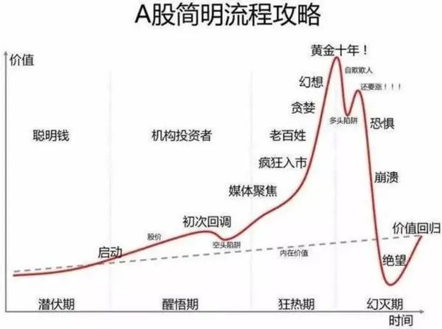

前几天看到了这个图.

叫"A 股简明流程".

挺有感触的, 就随便闲聊几句.

1、虚线是一个市场或公司的价值. 基本是以一定的速率上升.

2、但是投资者的情绪会促使价格发生巨大的波动.

3、整个过程划分为四个时期.

潜伏期, 只有最有耐力、最有远见的人待在市场;

醒悟期, 一部分投资者开始关注, 包括敏锐的机构投资者;

狂热期, 各种消息和媒体开始渲染.

大部分散户或者韭菜, 甚至贪婪的机构都是这个时期进入的.(尤其是这一时期的后半段)

幻灭期, 高估值破灭, 回归价值, 甚至跌到价值线以下.

继续酝酿下一个"潜伏期".

狂热期是最危险的, 但场内的人觉得最安全.

幻灭期, 是风险释放得差不多了, 但场内的人觉得好危险.

潜伏期, 是最安全的, 但场内外的人觉得最无聊和绝望.

然后, 每个人都希望能在醒悟期(或狂热期前期)进场, 快速、大量地赚一大笔.

可惜事与愿违, 大部分人是狂热期中后期才姗姗来迟.

又在幻灭期割肉离场.

你第一次投资, 是在哪个时期进场的呢?

你认为现在是处于哪一时期的可能性比较大呢?

## 原文

- [明天有新债上市.](https://mp.weixin.qq.com/s/se4MlvGFWIWt31J-dBG1qw)
